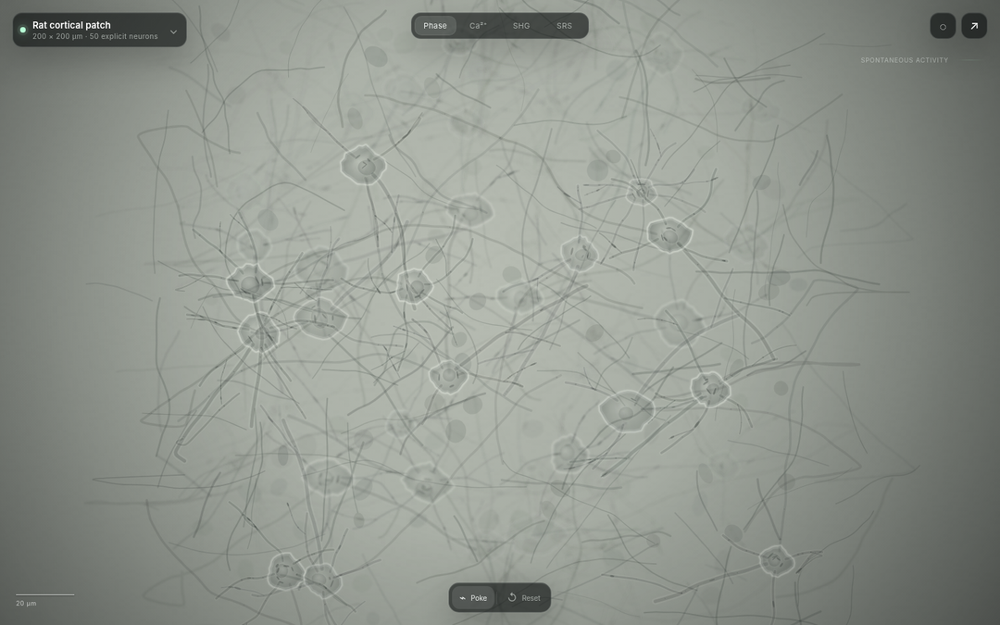

# BiologicalSetup

**A canvas-first living specimen workbench for interacting biological systems.**

The current V2 opens directly into a 200 µm rat cortical patch containing fifty explicit reduced-order neurons. Poke neurons, move the focal plane and observe the same tissue through phase, calcium, SHG and SRS modes.



## Run locally

No build step or runtime dependency is required.

```sh
npm run verify
npm run serve
```

Open `http://127.0.0.1:4173/`.

## Controls

- Click or touch: poke the nearest neuron.
- Drag: continue the local perturbation.
- Scroll: move the focal plane.
- Ctrl/Command + scroll: optical zoom.
- 1–4: phase, calcium, SHG and SRS.
- Space: pause or resume.
- R: reset.
- Right click: select without stimulation.

## First specimen

The first slice contains:

- 200 × 200 × 40 µm local tissue volume;
- 40 excitatory and 10 inhibitory explicit neurons;
- deterministic morphology, synthetic connectivity and subcellular traffic;
- reduced membrane-voltage, calcium-indicator, metabolism and stress state;
- sparse spontaneous activity;
- direct local stimulation;
- modality-specific observation engines rather than colour filters;
- minimal contextual interface over a full-screen canvas.

This is a qualitative research visualization, not a calibrated slice-culture predictor.

## Repository map

- [`VISION.md`](VISION.md) — product thesis and long-term canvas.
- [`BIOLOGICAL_MODEL_CONTRACT.md`](BIOLOGICAL_MODEL_CONTRACT.md) — state, units, dynamics and omissions.
- [`INTERFACE_CONTRACT.md`](INTERFACE_CONTRACT.md) — separation of biology, tools and microscopes.
- [`CLAIMS_AND_VALIDATION.md`](CLAIMS_AND_VALIDATION.md) — allowed claims and validation layers.
- [`ACCEPTANCE_TESTS.md`](ACCEPTANCE_TESTS.md) — product, model and observation acceptance.
- [`src/model.js`](src/model.js) — cortical network state and stepping.
- [`src/morphology.js`](src/morphology.js) — deterministic cells, neurites and organelles.
- [`src/renderer.js`](src/renderer.js) — phase, calcium, SHG and SRS observations.
- [`src/app.js`](src/app.js) — canvas interaction and compact instrument UI.

## Scientific boundary

The implementation distinguishes biological state from observation state. The user changes the specimen; the microscope reveals the result. Observation concepts are constrained by primary literature listed in [`docs/SCIENTIFIC_REFERENCES.md`](docs/SCIENTIFIC_REFERENCES.md), but numerical output and rendered pixels are not experimentally calibrated.

No clinical, diagnostic, therapeutic, toxicity or patient-specific inference is supported.
